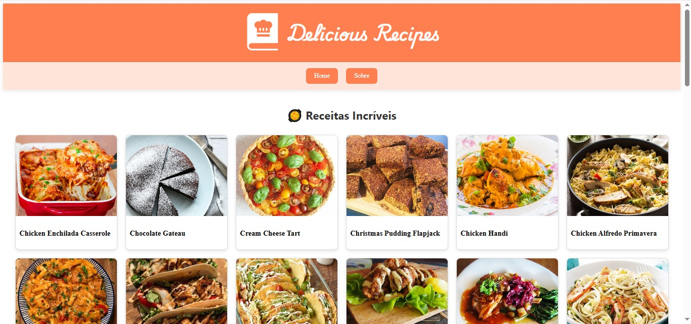
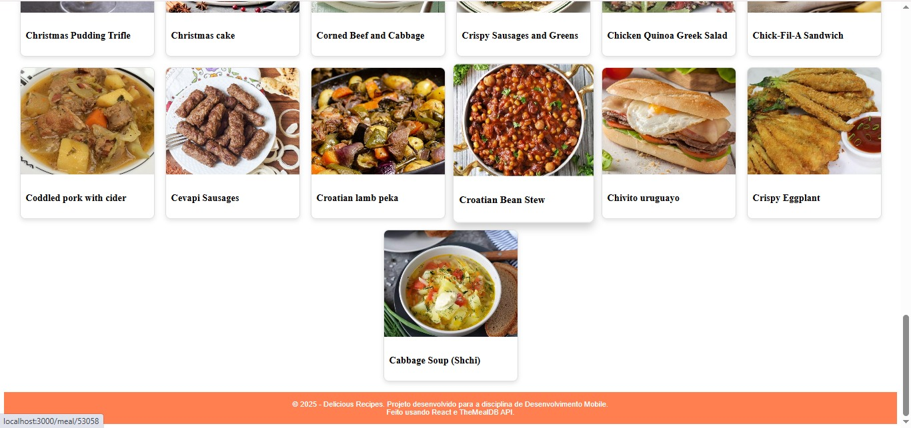
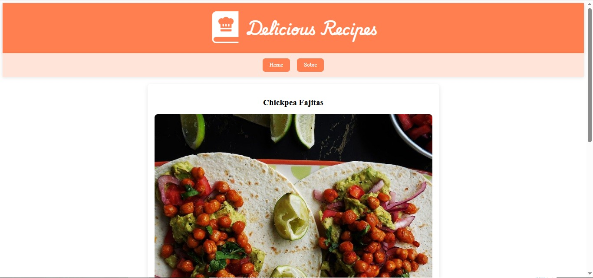
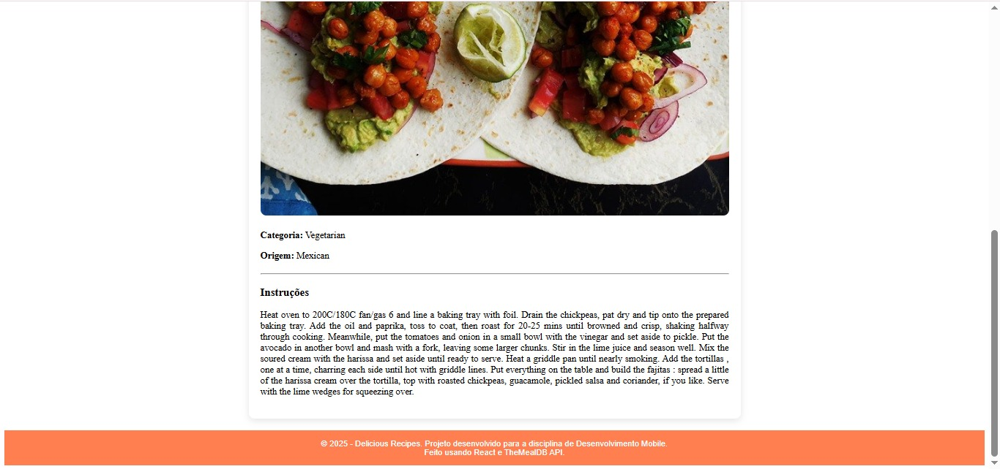
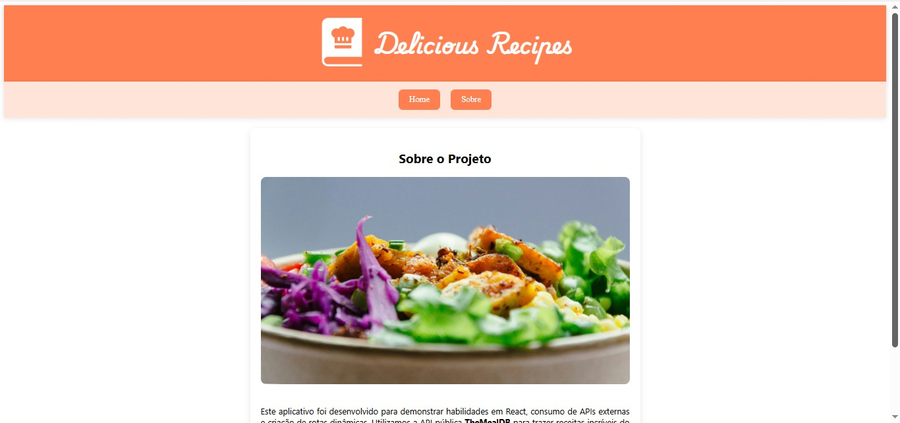
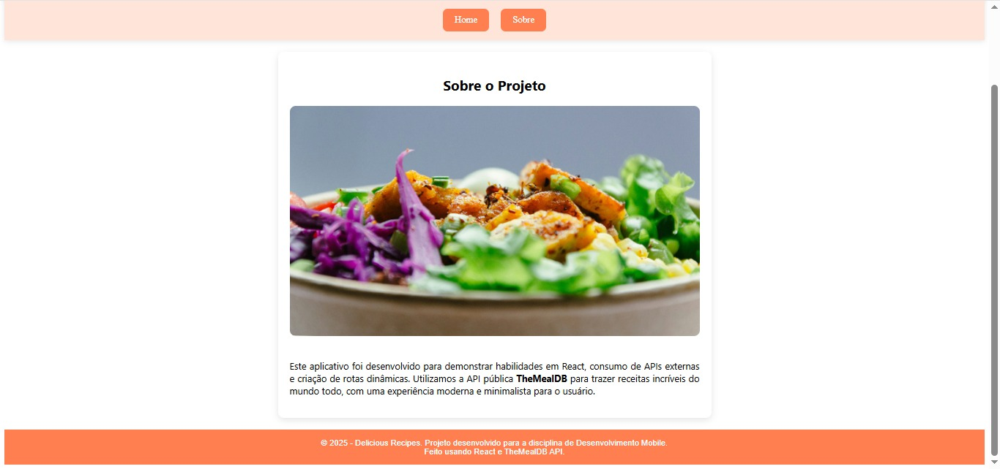

# Delicious Recipes APP

Aplicativo React que consome a [TheMealDB API](https://www.themealdb.com/api.php) para exibir receitas com imagens e detalhes.

Este projeto foi desenvolvido como trabalho prático para a disciplina de Desenvolvimento Web.

**<p align=center><a href="https://recipes-app-guilhermesandrades-projects.vercel.app/">Teste clicando aqui!</a></p>**

## 📚 Introdução ao App

Ao iniciar o aplicativo, o usuário é direcionado para a tela Home, onde é exibida uma lista de receitas de diversos pratos consumidos da API TheMealDB.

Cada receita apresenta:

- Imagem do prato

- Nome do prato

O usuário pode clicar em qualquer receita para ser redirecionado para a tela de detalhes, onde poderá visualizar:

- Nome completo do prato

- Foto grande do prato

- Categoria da comida (Ex: Beef, Chicken, Dessert)

- Origem (país de origem do prato)

- Instruções de preparo detalhadas

Além da tela principal e das páginas de detalhes das receitas, o app também possui uma tela Sobre, acessível pelo menu superior.
Na tela Sobre, o usuário encontra:

- Informações sobre o propósito do projeto

- Contexto da criação do app

- Imagem decorativa relacionada à culinária

Todas as navegações entre páginas são feitas utilizando Rotas Dinâmicas e Links Internos, garantindo uma experiência fluida e intuitiva.

## 🚀 Tecnologias utilizadas

- React
- React Router DOM
- TheMealDB API


## 📷 Imagens da aplicação

**Utilizando o APP**


<br/><br/>

**Tela Principal:**



<br/><br/>

**Tela de detalhes da Receita:**



<br/><br/>

**Tela Sobre:**



<br/><br/>

## ⚙️ Como executar o projeto localmente

Clone o repositório:

```bash
git clone https://github.com/guilhermesandrade/Recipes-App

cd Recipes-App
```
Instale as dependências:
```bash
npm install
```
Execute o projeto:
```bash
npm start
```
<br/>

## 📚 Funcionalidades

- Listagem de receitas com imagens

- Página de detalhes de cada receita

- Design responsivo e moderno

- Rotas dinâmicas com React Router

## 🌐 Link para testar a aplicação Web
👉 <a href="https://recipes-app-guilhermesandrades-projects.vercel.app/">Clique aqui para acessar o app online</a>

## 🔰 Código Fonte:

Disponíveis na pasta src.

Principais arquivos e funções:

- **src/App.jsx:** Configuração das rotas internas, header, footer e navegação.

- **src/pages/Home.jsx:** Tela inicial que lista as receitas da API.

- **src/components/MealList.jsx:** Componente que exibe os cards das receitas.

- **src/components/MealDetail.jsx:** Tela de detalhes da receita selecionada através da rota dinâmica.

- **src/pages/About.jsx:** Página informativa sobre o aplicativo.
